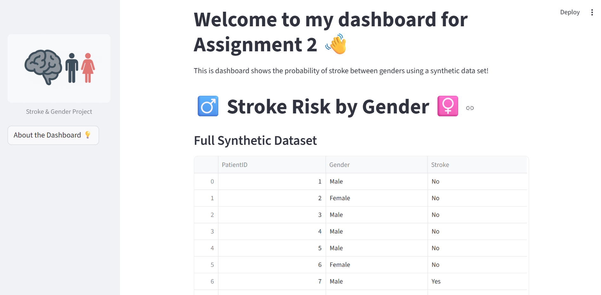
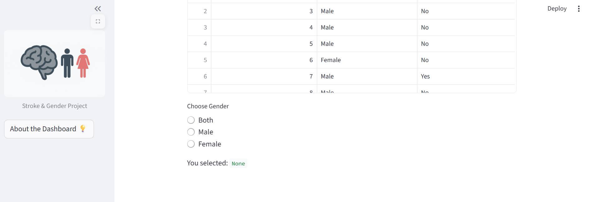
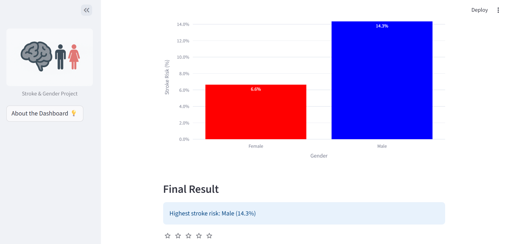

# PROHI Dashboard Example

**Author**: [Johannes Haddad]
<!-- As main author, do not write anything in the line below.
The collaborator will edit the line below in GitHub -->
**Collaborator**:Isha Bhansali

_Note that this file is written in **MarkDown** language. A reference is available here: <https://www.markdownguide.org/basic-syntax/>_

_Here you can include images, like the logo from SU_


## Introduction

_This template project will contain a simple interactive web dashboard with Streamlit. Feel free to edit this document as desired_

## System description

### Installation of libraries

Run the commands below in a terminal to configure the project and install the package dependencies for the first time.

If you are using Mac, you may need to install Xcode. Check the official Streamlit documentation [here](https://docs.streamlit.io/get-started/installation/command-line#prerequisites).

1. Create the environment with `python -m venv env`
2. Activate the virtual environment for Python
   - If using Mac or Linux, type the command: `source env/bin/activate` 
   - If using Windows:
   - First, [set the Default Terminal Profile to CMD Terminal](https://code.visualstudio.com/docs/terminal/profiles)
   - Then, type in the CMD terminal: `.\env\Scripts\activate.bat`
3. Make sure that your terminal is in the environment (`env`) not in the global Python installation. The terminal should start with the word `env`
4. Install required packages `pip install -r ./requirements.txt`
5. Check that the installation works running `streamlit hello`
6. Stop the terminal by pressing **Ctrl+C**

### Execute custom Dashboard

First, make sure that you are running Python from the environment. Check the steps 2 and 3 above. Then, to run the custom dashboard execute the following command:

```
> streamlit run Dashboard.py
# If the command above fails, use:
> python -m streamlit run Dashboard.py
```

### Dependencies

Tested on Python 3.12.7 with the following packages:
  - Jupyter v1.1.1
  - Streamlit v1.46.1
  - Seaborn v0.13.2
  - Plotly v6.2.0
  - Scikit-Learn v1.7.0
  - shap v0.48.0

## Contributors

 Dashboard author: Johannes Haddad

URL Link to my Dasboard for Assignment 2: 




This dashboard is made from a synthetic data set. The goal was to make a simple dashboard that displays the risk of stroke between male and female. I added the data set and made it clearer to show the user which patient, by ID, who had a stroke and not. The chart shows the percentage result of which gender had the highest risk of stroke. At the end, I added a "final result" that showed the gender with the highest risk for stroke


For my widgets, I added a button that would function as a link to the "About" page. I added option for the data set to allow the user to only focus on one gender or both, as well as a rating system that the user could use to allow me gain some feedback. 